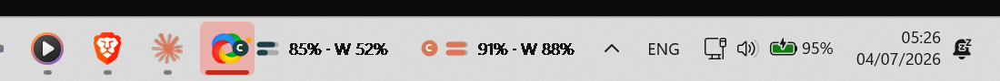
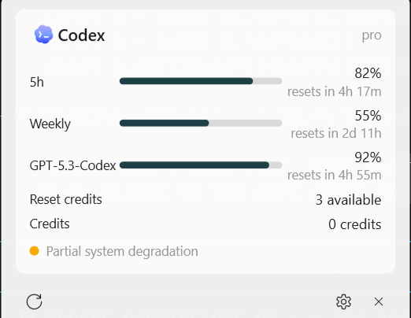

# CodexWinBar 🎚️ — May your tokens never run out. Now on Windows.

> Every AI coding limit, on your Windows 11 taskbar.

**CodexWinBar** is a native Windows 11 rebuild of [steipete/CodexBar](https://github.com/steipete/CodexBar)
(the macOS menu-bar app, MIT). It puts your AI coding-provider usage limits **directly on the taskbar** —
embedded next to the system tray so it looks like it was always part of Windows — with per-provider session
and weekly windows, reset countdowns, credits, and live provider-status incidents.

<p align="center">
  
</p>
<p align="center">
  
</p>

## What it does

- **Taskbar-embedded widget** — a compact chip rendered *inside* `Shell_TrayWnd` (true `SetParent`
  embedding with per-pixel alpha, validated by a runtime capability probe) showing tiny session/weekly
  gauges and percent text per provider. It sizes itself to the free space beside your taskbar apps,
  collapsing from full gauges → single gauge → compact icons as you add providers (never a scrollbar), and
  gently bounces the provider you're on pace to run out of first. If embedding isn't possible on your build,
  it automatically falls back to a tracked overlay; Explorer restarts re-embed automatically.
- **Fluent flyout** — click the widget for provider cards: usage bars, "resets in 2h 13m" countdowns,
  model-specific windows, reset credits, credit balances, plan/account identity, and live status incidents
  (Statuspage/Google Workspace feeds). Optional **pace** indicator projects whether you're on track to run
  out early, and clicking a provider opens its web dashboard. Acrylic backdrop, rounded corners, light/dark aware.
- **Native engine** — zero-dependency .NET 9: OAuth token refresh, per-provider fetch pipelines with
  fallback strategies, single-flight coalescing, reset-boundary refresh (re-poll ~30s after a window
  resets), quota threshold notifications.
- **Config-compatible with CodexBar** — reads/writes the same `~/.config/codexbar/config.json`
  (`CODEXBAR_CONFIG` and legacy `~/.codexbar` honored; unknown fields and providers round-trip untouched),
  so a dotfile-synced setup works across macOS and Windows.

## Providers (v1)

| Provider | Source | Auth |
|---|---|---|
| **Codex** | ChatGPT backend usage + reset credits | Codex CLI `~/.codex/auth.json` (OAuth, auto-refresh) or API key |
| **Claude** | `api.anthropic.com` OAuth usage | Claude Code `~/.claude/.credentials.json` (auto-refresh) |
| **Copilot** | `copilot_internal/user` quota snapshots | GitHub device flow (built into Settings) |
| **Gemini** | Cloud Code quota API | Gemini CLI `~/.gemini/oauth_creds.json` |
| **OpenRouter** | credits + key limits | API key |
| **OpenAI Admin** | org cost dashboards | Admin API key |
| **z.ai** | coding-plan quota | API key |
| **Cursor** | plan + Auto/Composer + on-demand usage | Browser session cookie |

Codex and Claude are enabled by default and work with zero setup if their CLIs are signed in. The rest are
enabled in **Settings → Providers**. Upstream's 50+ provider catalog is on the roadmap — the remaining
browser-cookie and WebView2 seams (Windsurf, Ollama quota, …) are deferred to a later release.

## Install

Fastest — one line of PowerShell, no admin, no SmartScreen prompt:

```powershell
irm https://raw.githubusercontent.com/ItayCohen-Prog/CodexWinBar/main/install.ps1 | iex
```

This grabs the latest release and installs it per-user. Because the download runs through PowerShell
(not a browser) it never picks up the Mark of the Web, so there's no "Unknown publisher" prompt.

Or with [winget](https://learn.microsoft.com/windows/package-manager/):

```powershell
winget install ItayCohen.CodexWinBar
```

> ⏳ **winget is in review** ([winget-pkgs #398215](https://github.com/microsoft/winget-pkgs/pull/398215)).
> Until it merges, use the PowerShell command above or the direct download.

Either way it installs per-user (no admin), adds Start-Menu and desktop shortcuts, launches automatically,
and self-updates. After installing, connect the providers you use in **Settings → Providers** — Codex,
Claude and Copilot sign in through your browser; OpenRouter, OpenAI Admin, z.ai and Cursor take an API key
or cookie. Nothing is connected until you sign in.

<details>
<summary>Direct download / build from source</summary>

**Direct download:** grab `CodexWinBar-win-Setup.exe` from the
[Releases page](https://github.com/ItayCohen-Prog/CodexWinBar/releases) and run it. Because it isn't
code-signed yet, Windows SmartScreen shows an "Unknown publisher" prompt — click **More info → Run anyway**
(one-time). The PowerShell command and winget both avoid this.

**Build from source:** requires Windows 11 and the [.NET 9 SDK](https://dotnet.microsoft.com/download/dotnet/9.0).

```powershell
git clone https://github.com/ItayCohen-Prog/CodexWinBar.git
cd CodexWinBar
dotnet publish src/CodexWinBar.App/CodexWinBar.App.csproj -c Release -r win-x64 --self-contained -p:PublishSingleFile=true -p:PublishReadyToRun=true -o artifacts/publish
artifacts\publish\CodexWinBar.exe
```

To produce a full installer locally: `./build/pack-windows.ps1` (needs `dotnet tool install -g vpk --version 1.2.0`).
</details>

Right-click the widget (or the tray icon) for Refresh / Settings / Quit. "Launch at login" lives in
Settings → General. Logs: `%LOCALAPPDATA%\CodexWinBar\logs\app.log`.

## Privacy

CodexWinBar keeps your credentials on your machine. It reads provider sessions from their standard local
locations (e.g. the Codex/Claude/Gemini CLI credential files) and talks **only to each provider's own API**
to fetch your usage — there is no CodexWinBar server, account, or telemetry, and nothing about your usage
leaves your computer. Stored credentials are written with restrictive per-user file permissions.

## Architecture

C# / .NET 9, **one runtime dependency** — [Velopack](https://velopack.io) for the installer and
auto-update; the app itself otherwise has zero external NuGet dependencies (test projects excepted):

- `CodexWinBar.Core` — provider abstraction (descriptor + ordered fetch strategies), CodexBar-compatible
  config store, refresh scheduler, status poller.
- `CodexWinBar.Providers` — one folder per provider; contributions need only a descriptor + strategy + parser.
- `CodexWinBar.Widget` — pure Win32: taskbar interop, embed/overlay state machine on a dedicated STA
  thread, GDI+ → `UpdateLayeredWindow` renderer.
- `CodexWinBar.App` — WPF shell: flyout, settings, tray icon, quota notifications, single instance.

Design docs and the upstream protocol research live in [`docs/windows-port/`](docs/windows-port/).

## Credits & license

This is a fork/rebuild of [CodexBar](https://github.com/steipete/CodexBar) by
[Peter Steinberger](https://github.com/steipete) — all product concepts, provider protocol research,
and the original macOS implementation are his. The Windows port reuses upstream's provider documentation
(`docs/`) as its protocol source of truth.

[MIT](LICENSE) — same as upstream.
